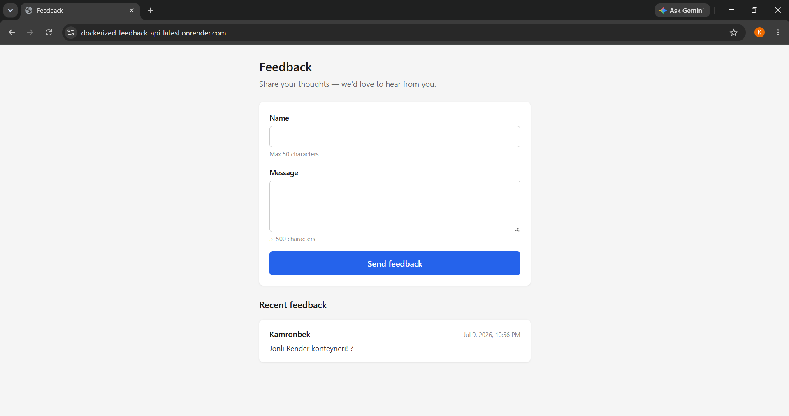
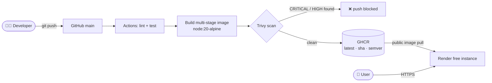

# Dockerized Feedback API
 

 
A small Express feedback API built to demonstrate a **production-style container pipeline**: multi-stage Docker build, non-root runtime, health checks, and a CI pipeline that **lints, tests, and security-scans every image before it can reach the registry**.
 
**🔗 Live demo:** https://dockerized-feedback-api-latest.onrender.com
 

 
## Architecture
 

 
**The container itself:** built in two stages (deps → runtime), runs as the unprivileged `node` user, ships **without npm** in the final image, and reports its own health via a Docker `HEALTHCHECK` hitting `/health`.
 
## Tech Stack
 
- **Node.js 20 + Express** — the API (kept intentionally small; the container pipeline is the point)
- **Docker** — multi-stage build on `node:20-alpine`, non-root, `HEALTHCHECK`
- **GitHub Actions** — lint → test → build → **Trivy scan** → push to GHCR
- **GitHub Container Registry** — public image with `latest`, `sha-*`, and `v*` tags
- **Render** — free-tier host pulling the public GHCR image
## API
 
| Method | Path | Description |
|---|---|---|
| `GET` | `/health` | Liveness check — used by Docker `HEALTHCHECK` and the host |
| `POST` | `/api/feedback` | Create feedback `{name, message}` — validated (name ≤ 50 chars, message 3–500), returns `400` on bad input |
| `GET` | `/api/feedback` | List all feedback, newest first |
| `GET` | `/api/feedback/:id` | Single item or `404` |
 
A tiny static frontend (plain HTML/JS) is served at `/` for manual testing.
 
## CI/CD Pipeline
 
| Stage | What it does |
|---|---|
| `lint-test` job | `npm ci` → ESLint → tests (Node's built-in runner + supertest against the exported app) |
| Build | Multi-stage image built locally on the runner |
| **Trivy scan** | Fails the pipeline on CRITICAL/HIGH vulnerabilities (`ignore-unfixed: true`) — **unscanned images can never reach the registry** |
| Push | Only after a clean scan, and never on pull requests — tagged `latest` (main), `sha-<commit>`, and `vX.Y.Z` (release tags) |
 
## What the pipeline caught (real incidents, week one)
 
1. **CVE in `tar` inside the base image's bundled npm.** The runtime never uses npm (`npm ci` only runs in the build stage), so instead of ignoring the finding I **removed npm from the final stage entirely** — eliminating the CVE and shrinking the attack surface.
2. **CVE-2026-45447 (OpenSSL heap use-after-free)** in the alpine base image, with a fix already published. OpenSSL can't be removed (Node needs it for TLS), so the correct move was **`apk --no-cache upgrade`** in the runtime stage to pull patched OS packages.
3. **Supply-chain aftershock:** my pinned `trivy-action@0.28.0` stopped resolving because the upstream project re-tagged all releases with a `v` prefix after a supply-chain attack. Pinning is still right — floating refs like `@master` are exactly what such attacks exploit — but pins need occasional maintenance. The gold standard is pinning to a commit SHA.
## Security Choices
 
- **Non-root runtime** (`USER node`) — a compromised app process is not root inside the container
- **No npm in the final image** — smaller attack surface, one real CVE eliminated
- **Secrets never baked in** — `.env` is excluded via `.dockerignore`; config is injected at runtime (`--env-file` locally, dashboard env vars on Render)
- **Least-privilege CI token** — the workflow's `GITHUB_TOKEN` has only `contents: read` + `packages: write`
## Live Demo & Free-Tier Notes
 
Runs on Render's free instance, which **spins down after ~15 minutes of inactivity** — the first request after idle takes **~50 seconds** while the container wakes up (Render's expected behavior). Subsequent requests are fast.
 
Storage is intentionally **in-memory**: data resets on every restart. The focus of this project is the container pipeline (multi-stage build → scan → registry → deploy), not persistence — a database is the natural next iteration.
 
## Running Locally
 
```bash
# Option 1 — from source
cp .env.example .env
docker compose up --build
# → http://localhost:3000
 
# Option 2 — straight from the registry (no clone needed)
docker run -d -p 3000:3000 -e NODE_ENV=production \
  ghcr.io/a-kamronb3k/dockerized-feedback-api:latest
```
 
Tests and lint:
 
```bash
npm ci
npm test
npm run lint
```
 
## Project Structure
 
```
├── .github/workflows/ci.yml   # lint → test → build → Trivy → GHCR
├── src/
│   ├── app.js                 # Express app (exported — testable without a server)
│   ├── index.js               # entrypoint: dotenv + listen
│   ├── routes/feedback.js     # validation + in-memory store
│   └── public/index.html      # tiny test frontend
├── tests/api.test.js          # node:test + supertest
├── Dockerfile                 # multi-stage, non-root, HEALTHCHECK, no npm
├── docker-compose.yml
├── docs/architecture.md       # design decisions & incident write-ups
└── screenshots/
```
 
## What I Learned
 
- A CI quality gate is only real if it can **fail** — mine blocked two genuine CVEs in its first week, and I fixed the causes instead of silencing the gate.
- Reading error messages beats guessing: in one week I hit my own bug, a correctly-failing gate, a GitHub platform outage, and an upstream re-tagging — four different failures, four different (correct) responses.
- Free tiers change without warning (my planned host added a mandatory subscription mid-sprint) — always have a plan B, and document the trade-offs of the one you ship on.
## License
 
MIT