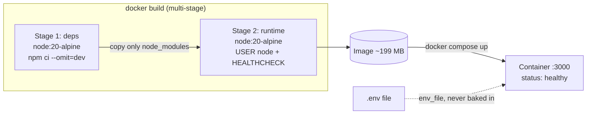

# Architecture & Design Decisions
 
## Overview
 
This is a small Express feedback API (create / list / get feedback + `/health`) built as **Project 2** of my cloud engineering sprint. The app itself is intentionally simple — the real goal of this project is to containerize it **the way it would be done in production**: a small, secure, self-checking image that anyone can run with one command.
 

 
## Container design decisions
 
### Why a multi-stage build
 
I split the Dockerfile into a **deps stage** and a **runtime stage** so that installation leftovers (npm cache, lockfile metadata) never reach the final image — only the production `node_modules` and the source code are copied over. This keeps the image small and the attack surface low. It also plays well with layer caching: `package*.json` is copied before the code, so dependencies are only reinstalled when they actually change, and everyday code changes rebuild in seconds.
 
### Why the container runs as non-root
 
By default containers run as root, which means that if the app is ever compromised, the attacker is root *inside* the container — a much stronger starting point for escaping or doing damage. The official Node image ships with a built-in unprivileged `node` user, so I copy files with `--chown=node:node` and switch to `USER node`. Now the process has only the permissions it actually needs, which is the same least-privilege principle I applied to my IAM roles in Project 1.
 
### Why a HEALTHCHECK
 
A container can be "running" while the app inside it is actually dead — the process exists, but it stopped answering requests. The `HEALTHCHECK` instruction makes Docker call my `/health` endpoint every 30 seconds, so `docker ps` honestly reports `healthy` or `unhealthy` instead of just "Up". This is also what orchestrators and PaaS platforms use to decide whether to restart a container or route traffic to it — so the endpoint I wrote on day one of this project is doing real operational work.
 
### Supporting decisions
 
- **`.dockerignore`** keeps `node_modules`, `.git` and — most importantly — **`.env`** out of the build context, so secrets can never be baked into an image layer.
- **Configuration comes only from environment variables** (`--env-file` locally, injected by the platform in production). The image is environment-agnostic: the same image runs in dev and prod, only the config changes.
- **`docker-compose.yml`** documents how to run the app, so "works on my machine" becomes `docker compose up`.
## Result
 
Final image: `node:20-alpine`-based, multi-stage, non-root, healthchecked — **199 MB** (vs ~1 GB for a naive single-stage `node:20` build).
 
## Deployment

The public GHCR image runs on **Render's free tier** (originally planned for Koyeb, 
which introduced a mandatory subscription mid-sprint — free tiers change, plans adapt). 
Render routes HTTPS traffic to the container's port 3000; config comes from dashboard 
env vars (`NODE_ENV=production`, `PORT=3000`), never baked into the image. The free 
instance spins down after ~15 min of inactivity; cold start is ~50s. 
The `/health` endpoint written on day one now serves three masters: Docker's 
HEALTHCHECK, the host's checks, and my own curl tests.

## What the pipeline caught (real incidents, week one)

The Trivy gate blocked two real vulnerabilities before they could reach the registry:

1. **CVE in `tar` inside the base image's bundled npm.** The runtime never uses npm 
   (`npm ci` only runs in the build stage), so instead of ignoring the finding I 
   **removed npm from the final stage entirely** — eliminating the CVE and shrinking 
   the attack surface.
2. **CVE-2026-45447 (OpenSSL heap use-after-free)** in the alpine base image, with a 
   fix already published upstream. Removing OpenSSL isn't an option (Node needs it 
   for TLS), so the correct move was **`apk --no-cache upgrade`** in the runtime 
   stage to pull patched OS packages.

Bonus lesson: my pinned `trivy-action@0.28.0` stopped resolving because the upstream 
project re-tagged all releases with a `v` prefix after a **supply-chain attack** — 
old tags were removed in the cleanup. Pinning is still right (floating refs like 
`@master` are exactly what such attacks exploit); pins just need occasional 
maintenance. The gold standard is pinning to a commit SHA.